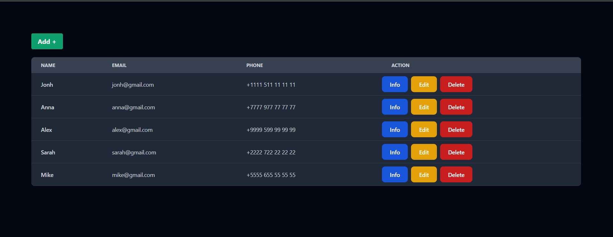

# User Management CRUD Application

This is a simple React.js application that demonstrates a basic CRUD (Create, Read, Update, Delete) operation using a mock API (JSON Server) to manage a list of users. The application features a clean UI with a table displaying user information and options to add, edit, view, or delete users.

## Features

- **Add User**: Click the "Add +" button to open a modal where you can add a new user by providing a name, email, and phone number.
- **View User**: Click the "Info" button to view detailed information about a user.
- **Edit User**: Click the "Edit" button to open a modal where you can modify the selected user's information.
- **Delete User**: Click the "Delete" button to remove a user from the list after confirmation.

